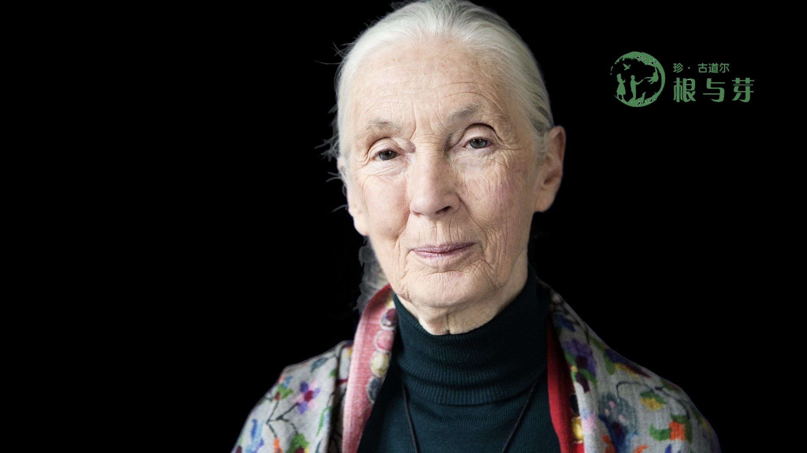

## 楊崗 Van is a Chinese-American director, writer, and cinematographer.

Currently a filmmaker in the [neuroscience lab](https://www.affective-science.org/) of [Lisa Feldman Barrett](https://lisafeldmanbarrett.com/).

## Work

"Dr. Jane Goodall in China"
{: .text-center}

"lululemon in Beijing" 
{: .text-center}

#### 歐陽娜娜 Ouyang Nana in Montréal
{: .text-center}

### Likes
innocent laughter, bright eyes that smile, *thunk* of opening a fresh coconut, cultivated intelligence, heartbeat of the drum, citations, sizzling food, beautiful voices, songs sung with soaring heart, peace

### Dislikes
deliberate unkindness, inconsiderate color palettes, selfish energy, the screeching whine of desperation, injustice, shoelaces, snake-oil salesmen, soulless superficiality, mosquitos, imperialism