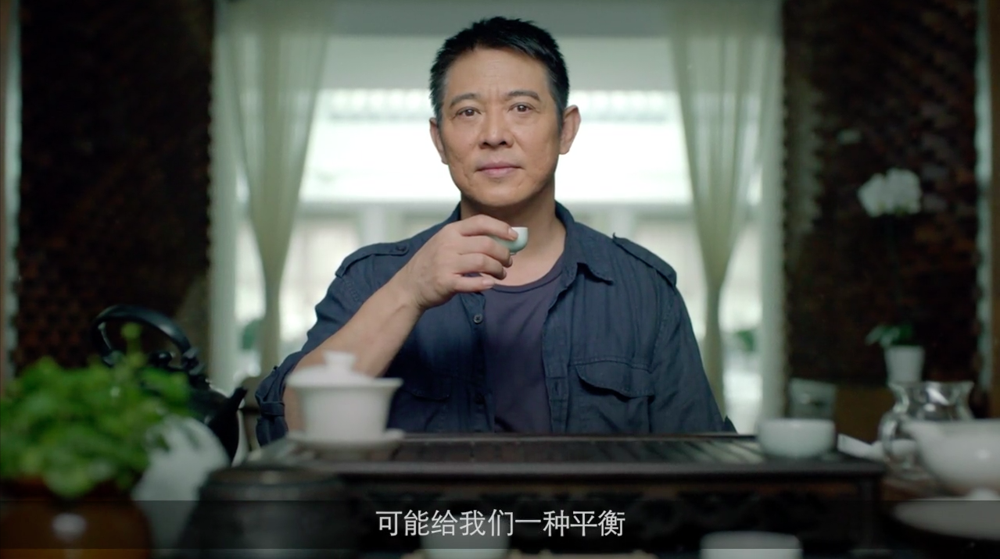
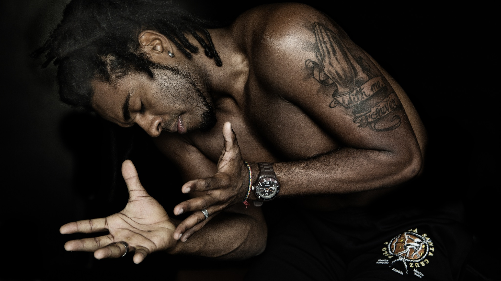
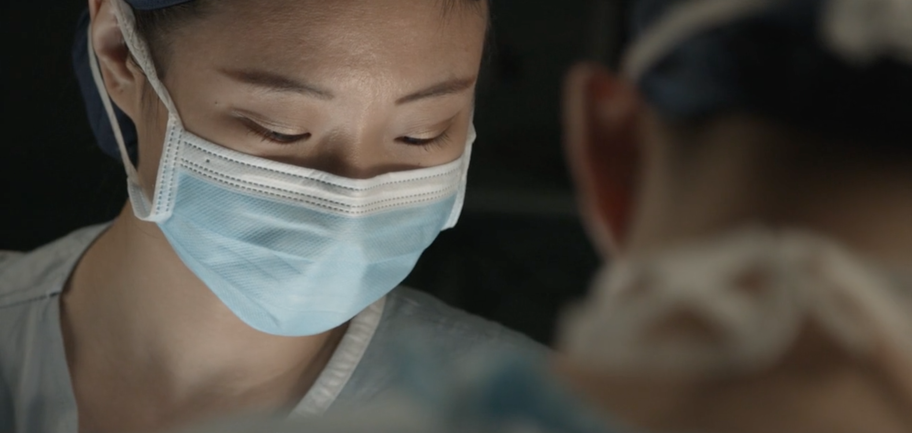
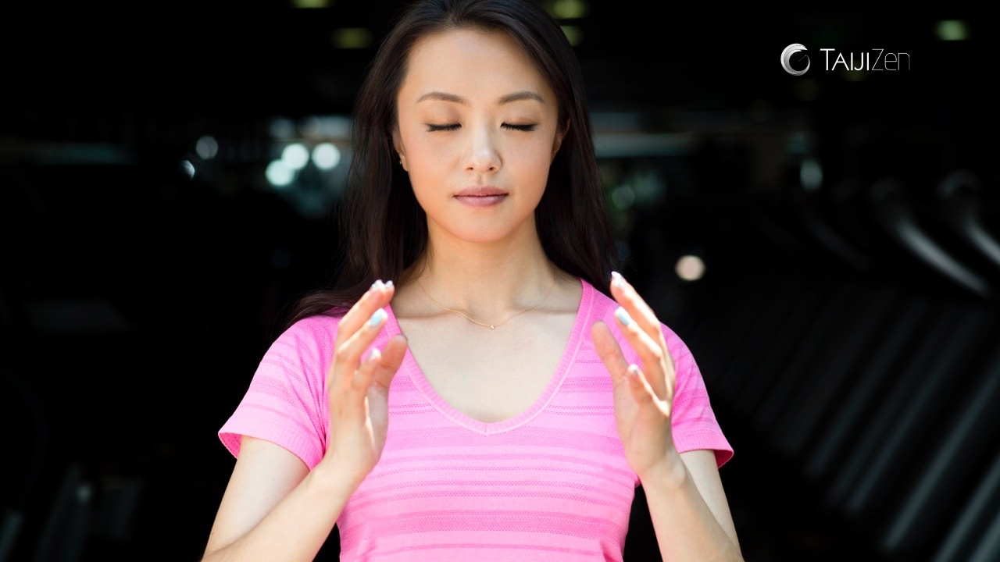

## 楊崗 Van is a Chinese-American director, writer, and cinematographer.

Currently a filmmaker in the [neuroscience lab](https://www.affective-science.org/) of [Prof. Lisa Feldman Barrett](https://lisafeldmanbarrett.com/).

## Portfolio
{: .text-center}
  <pre>

</pre>

#### Dr. Jane Goodall
{: .text-center}
<pre>

</pre>

#### 歐陽娜娜 Ouyang Nana
{: .text-center}
<pre>

</pre>

#### lululemon 
{: .text-center}
<pre>

</pre>

#### Godfrey Gao
{: .text-center}
<pre>

</pre>

#### Jet Li
{: .text-center}
<pre>

</pre>

#### Audi
{: .text-center}
<pre>

</pre>

#### Mestre XUXO
{: .text-center}
<pre>

</pre>
* * *
### Things I Like
innocent laughter, bright eyes that smile, *thunk* of opening a fresh coconut, cultivated intelligence, heartbeat of the drum, citations, sizzling food, beautiful voices, songs sung with soaring heart, peace

### Things I Dislike
deliberate unkindness, inconsiderate color palettes, selfish energy, the screeching whine of desperation, injustice, shoelaces, snake-oil salesmen, soulless superficiality, mosquitos, imperialism
* * *
<pre>

</pre>

